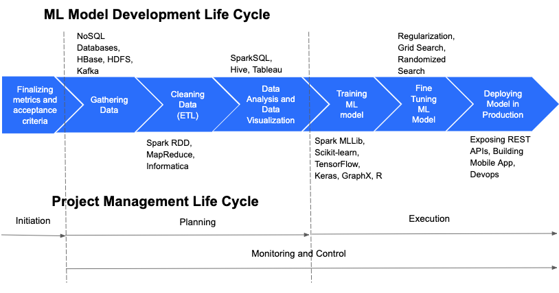

# Quick-start-to-ML

We want to show you in practice how to take your first steps with machine learning without getting drowned in theory. So we will only give you the ‘need-to-know’ of what machine learning is.

Here is a great introduction which just takes 5 minutes to [read](https://towardsdatascience.com/introduction-to-machine-learning-for-beginners-eed6024fdb08) 
Now that you know what you are getting into, let's begin by diving into data problems and solving them. The typical approach to solve a problem is shown in the following image.
 

Here, we will be focussing on stages 3,4,5 and 6 as we want you to get hands-on with modelling. Here are some examples you can try out in your jupyter notebooks by running them and understanding the commonly performend tasks in each example. You can first look at how notebooks work if you haven't used it before. You can then start by preparing the dataset and then building your predictive models. Once you are through it, test your skills by solving the problem in the final example.

[Familiarize with notebooks](https://github.com/anupamadas31/getting-started-with-ML/blob/master/Running%20Code.ipynb) 
[1. Warm up!](https://github.com/anupamadas31/getting-started-with-ML/blob/master/exploratory%20data%20analysis.ipynb) 
[2. Data prep](https://github.com/anupamadas31/getting-started-with-ML/blob/master/data%20wrangling%20and%20prediction.ipynb) 
[3. Predictive models and model selection](https://github.com/anupamadas31/getting-started-with-ML/blob/master/data%20wrangling%20and%20prediction.ipynb) 
[4. Checking model performance](https://github.com/anupamadas31/getting-started-with-ML/blob/master/data%20wrangling%20and%20prediction.ipynb) 
[5. Take a test](https://github.com/anupamadas31/getting-started-with-ML/blob/master/Sales%20Prediction_%20test.ipynb) 

Want to learn more? Jump to:
[Kaggle](https://www.kaggle.com/datasets?fileType=csv) to find more datasets, problems and solve them

**Stay tuned for more updates on how to deploy models and to get hands on with ML Ops!**

